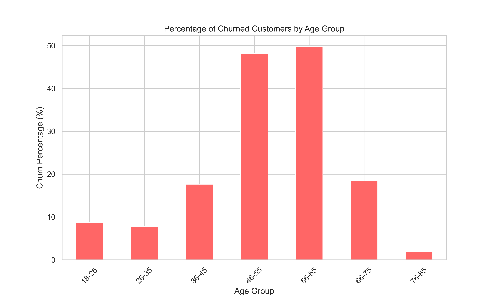

## 1. Project Overview

### Introduction

This project explores and analyzes customer churn data to uncover underlying patterns and factors that lead to customer attrition. Customer churn refers to the rate at which customers stop doing business with a company. Understanding and predicting customer churn is crucial for businesses as it significantly impacts profitability. Research shows that acquiring a new customer can be anywhere from five to 25 times more expensive than retaining an existing one (Gallo, 2014). Furthermore, a study by Frederick Reichheld of Bain & Company reveals that increasing customer retention rates by 5% increases profits by 25% to 95%, underscoring the substantial impact of effective retention strategies (Gallo, 2014).

### Objectives

The primary goals of this project are to:

- **Identify Key Factors**: Determine the demographic and service-related factors that significantly impact customer churn.
- **Predictive Modeling**: Employ logistic regression and random forests to forecast potential churn effectively, enabling proactive retention strategies.
- **Data-Driven Insights**: Provide actionable insights that businesses can use to enhance customer engagement and reduce churn rates.

These objectives aim to equip businesses with better tools to improve their customer retention strategies, thereby enhancing their overall profitability.

## 2. Dataset Description

### Source
This dataset is sourced from [Kaggle](https://www.kaggle.com/datasets/radheshyamkollipara/bank-customer-churn). It provides insights into customer churn at a bank.

### Features
The dataset comprises several attributes related to bank customers:
- **RowNumber** (`int`): The record number, irrelevant to the output.
- **CustomerId** (`int`): Random values, irrelevant to the output.
- **Surname** (`string`): Irrelevant to the customer's decision to leave.
- **CreditScore** (`int`): Customer's credit score.
- **Geography** (`string`): The customer's location.
- **Gender** (`string`): The customer's gender.
- **Age** (`int`): The customer's age.
- **Tenure** (`int`): Number of years the customer has been with the bank.
- **Balance** (`float`): Account balance.
- **NumOfProducts** (`int`): Number of products the customer has with the bank.
- **HasCrCard** (`int`): Whether the customer has a credit card.
- **IsActiveMember** (`int`): Whether the customer is an active member.
- **EstimatedSalary** (`float`): The estimated salary of the customer.
- **Exited** (`int`): Whether the customer has left the bank.
- **Complain** (`int`): Whether the customer has registered a complaint.
- **Satisfaction Score** (`int`): Customer's satisfaction score.
- **Card Type** (`string`): Type of card held by the customer.
- **Points Earned** (`int`): Points earned by the customer.

### Size and Scope
The dataset contains 10,000 detailed records of bank customers. It covers various aspects of customer behavior and attributes, helping to analyze trends over time in customer churn.

## 3. KPI Visualizations
To effectively analyze the factors influencing customer churn, we have grouped the visualizations into three categories. Each category highlights a different aspect of customer data, providing a layered understanding of what drives churn.

### Demographic Insights

### Age Group Analysis

  
**Figure 1: Churn Percentage by Age Group**  

The Figure 1 provides a detailed view of churn rates across different age groups. It reveals that churn rates are particularly high in the middle age brackets, specifically the 36-45 and 56-65 age groups, where churn rates exceed 40%. This suggests that mid-life financial demands or service expectations might not be met by current banking offerings. In contrast, both younger (18-25) and older age groups (76-85) show significantly lower churn rates, indicating different banking needs or higher satisfaction levels within these demographics.

### Gender and Geography Analysis

**Figure 2: Churn Percentage by Gender Across Geographies**  

The Figure 2 compares churn rates by gender across three different geographies: France, Spain, and Germany. Notably, churn rates for females in Germany are disproportionately high compared to their male counterparts, indicating potential dissatisfaction or unmet needs among female customers in this region. In contrast, France shows more balanced churn rates between genders but overall lower than in Germany. Spain displays a moderate churn rate with males showing slightly higher churn than females. This variation across geographies suggests that location-specific factors and possibly cultural aspects significantly influence customer retention.

These insights emphasize the importance of demographic targeting and customization in banking services to address the specific needs and behaviors of different customer segments. Tailoring products and communication strategies to these insights could help mitigate churn and enhance customer loyalty.

### References

- Gallo, A. (2014). The Value of Keeping the Right Customers. Harvard Business Review. Retrieved from [https://hbr.org/2014/10/the-value-of-keeping-the-right-customers](https://hbr.org/2014/10/the-value-of-keeping-the-right-customers).

